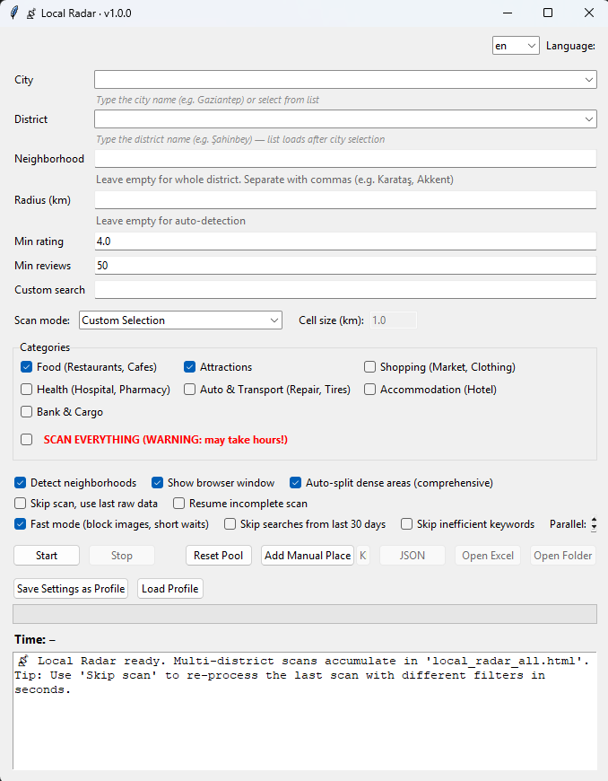

# 📡 Local Radar

**Scan, discover, plan.** — Find the best local places around you.

Local Radar is a personal travel guide generator. It scrapes Google Maps for highly-rated places in a given district or neighborhood, filters them by rating and review count, categorizes them automatically, and generates an interactive HTML guide.

**Available in Turkish and English** — switch language from the top-right dropdown.

## ✨ Features

- 🗺️ **Interactive map** — Leaflet + OpenStreetMap, no API key needed
- 📅 **Day planner** — Assign places to G1–G5 and filter by day
- 💰 **Budget tracker** — Total, per person, and per day cost estimation
- ⭐ **Favorites & tracking** — Mark places as favorites, visited, add notes
- 📤 **Share & route** — WhatsApp share and Google Maps multi-stop route
- 🌙 **Dark mode** — Automatic based on system preference
- 📱 **Mobile-friendly** — Responsive design for phones and tablets
- 🌍 **Multi-language** — Turkish and English UI
- 🧠 **Self-healing scraper** — Resilient selectors with multi-fallback
- ⚡ **Smart grid** — Auto-splits dense areas to bypass Google's ~120 result limit

## 🎯 What It Does

1. **Location lookup** — Nominatim (OpenStreetMap) resolves the district to coordinates
2. **Grid generation** — Slippy-map tiles divide the area into searchable cells
3. **Search** — Playwright navigates to each Google Maps search URL and scrolls the feed
4. **Extraction** — Parses name, rating, review count, address, and coordinates
5. **Filtering** — Removes permanently closed, out-of-area, low-rated, and low-review places
6. **Categorization** — Rule-based classifier with over 200 keywords
7. **Neighborhood detection** — OpenStreetMap boundaries + address parsing + Nominatim fallback
8. **Deduplication** — Same name + coordinates merged automatically
9. **Export** — CSV, XLSX, JSON, KML, and interactive HTML

## 🌍 Languages

Local Radar supports **Turkish** and **English**.

| Language | Description |
|----------|-------------|
| 🇹🇷 **Türkçe** | Şehir, ilçe, mahalle, kategori gibi alanlar Türkçe etiketlerle görünür. |
| 🇬🇧 **English** | All labels, buttons, and messages in English. |

**Switch language:** Use the dropdown in the top-right corner. The interface updates instantly, and your choice is saved.

**Adding a new language:**
1. Open `local_radar_gui.py`
2. Find the `METINLER` dictionary
3. Copy the `"en"` block
4. Translate all values to your language
5. Rename the key (e.g. `"de"` for German)
6. Add it to the language dropdown values

## 🚀 Quick Start

### Requirements

- Python 3.10 or newer
- Windows, Linux, or macOS
- Playwright (Chromium or Edge)
- openpyxl (for Excel output)

### Installation

    git clone https://github.com/cisey/local-radar.git
    cd local-radar
    pip install -r requirements.txt
    playwright install chromium
    python local_radar_gui.py

### Quick Launch (Windows)

Double-click **`run.bat`** to launch the GUI without opening a terminal.

The batch file automatically:
- Changes to the project directory
- Checks if Python is installed
- Launches `local_radar_gui.py`
- Keeps the window open if an error occurs

### First Scan

1. Open the GUI
2. **Select your language** from the top-right dropdown
3. Type a **City** (e.g. Gaziantep) — the district list will load
4. Select a **District** (e.g. Şahinbey)
5. Choose a scan mode:
   - **Fast** — Food + Attractions (quick)
   - **Normal** — Food + Attractions, grid-enabled (recommended)
   - **Comprehensive** — Everything (may take hours)
6. Set minimum rating and review count
7. Click **Start**

Wait 5 to 20 minutes depending on the area.

## 📁 Project Structure

    local-radar/
      local_radar_core.py      Core engine (scraper, categorizer, exporters)
      local_radar_gui.py       Tkinter GUI (TR/EN)
      test_local_radar.py      Basic test suite
      requirements.txt         Python dependencies
      README.md                This file
      LICENSE                  MIT License
      .gitignore               Excludes personal data from Git

Data files (pool, caches, output guides) are **not** committed to Git — they live outside the repo.

## 📊 Output Formats

| Format | Purpose |
|--------|---------|
| **HTML** | Interactive guide with map, filters, day planner, budget tracker |
| **CSV** | Raw data for spreadsheet analysis |
| **XLSX** | Formatted Excel with color-coded ratings and clickable links |
| **JSON** | Programmatic use, easy to parse |
| **KML** | Opens in Google Earth, Google My Maps, and other GIS tools |

## 🎨 Screenshots

### GUI (English)

The interface with English labels, language selector, and empty fields ready for input.

### Interactive Guide

The generated HTML guide with map, day planner, and budget tracker.

## ⚠️ Disclaimer

This tool scrapes publicly available data from Google Maps. Use it responsibly:

- **Personal use only** — respect Google's Terms of Service
- **Rate limiting** — do not run aggressive parallel scans
- **No warranty** — Google may change its DOM at any time
- **Not affiliated with Google**

Local Radar is provided as-is for educational and personal use.

## 🤝 Contributing

Pull requests are welcome. Especially:

- More categorization keywords
- Additional language support (currently Turkish + English)
- Route optimization (traffic-aware)
- Mobile app wrapper
- Docker container

**Adding a language:**
1. Open `local_radar_gui.py`
2. Find the `METINLER` dictionary
3. Copy the `"en"` block
4. Translate all values to your language
5. Rename the key (e.g. `"de"` for German)
6. Add it to the language dropdown values

## 📜 License

MIT License — see the [LICENSE](LICENSE) file for details.

## 💡 Acknowledgments

- **Playwright** — browser automation
- **OpenStreetMap / Nominatim / Overpass** — map data
- **Leaflet** — interactive maps
- **Openpyxl** — Excel output

Made with ❤️ for travelers and foodies.